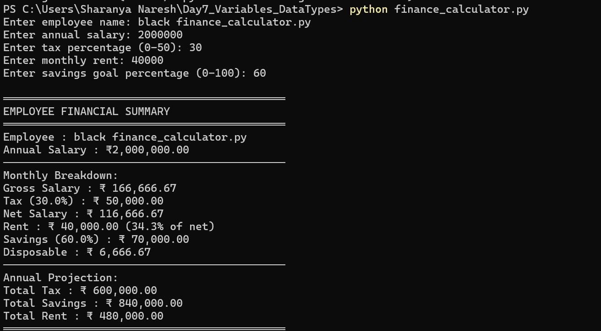
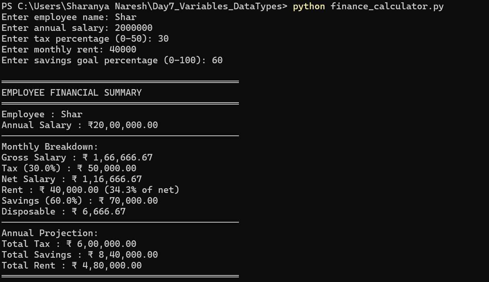
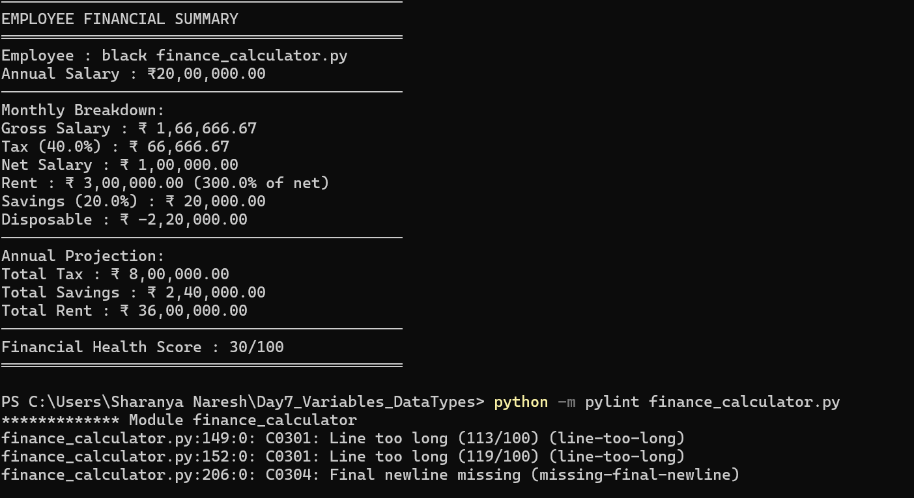
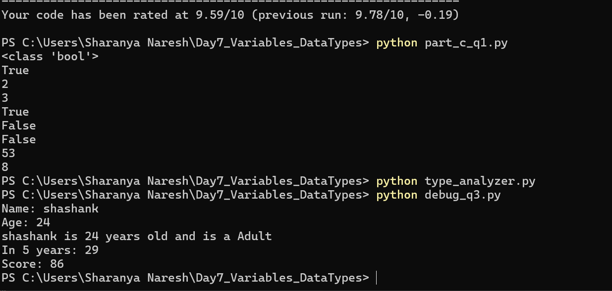

# Day 7 – Variables, Data Types & Git  
PG Diploma AI-ML & Agentic AI  

---

## ✅ Part A – Personal Finance Calculator

### Features Implemented
- Input validation
- Financial calculations
- Indian number formatting (Lakhs system)
- Financial health score
- PEP 8 compliant
- Pylint score: 9.59/10

---

### Sample Output Screenshot

---

## ✅ Part B – Stretch Features

### Indian Number Formatting
Implemented custom function to format currency in Indian numbering system.

Example:
₹20,00,000.00

### Financial Health Score (0–100)

Scoring Criteria:
- Rent ratio < 30% → +30
- Savings rate ≥ 20% → +30
- Disposable income ≥ 20% → +40

---

## ✅ Part C – Interview Ready

### Q1 – Data Type Outputs

| Code | Output |
|------|--------|
| `type(True)` | `<class 'bool'>` |
| `isinstance(True, int)` | `True` |
| `True + True + False` | `2` |
| `int(3.99)` | `3` |
| `bool("False")` | `True` |
| `bool("")` | `False` |
| `0.1 + 0.2 == 0.3` | `False` |
| `"5" + "3"` | `53` |
| `5 + 3` | `8` |

---

### Q2 – Type Analyzer Function

Implemented function that analyzes:
- Value
- Type
- Truthiness
- Length

Screenshot:

---

### Q3 – Debugging

Fixed issues:
- Type conversion errors
- String/int comparison
- f-string formatting bug
- Incorrect format specifier

---

## ✅ Part D – AI-Augmented Task

### Prompt Used

